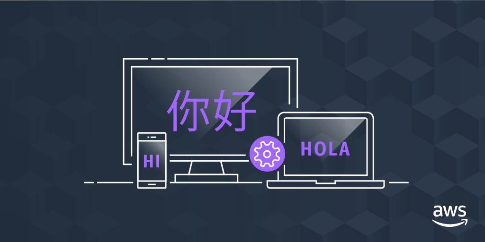

# Exploring ML Tools - AWS Translate

According to one of the surveys there are roughly 6500 languages spoken in whole world.
However, I am sure that actual number is definitely more. So, it 99.9% impossible to
learn all the languages in the world, but we as human are always keen to know the unknowns.
So ideally if we have a tool which can translate foreign language to the one that we know,
then it would really take the pain away in understanding someone with foreign language.
So, in this blog we will focus on an AWS tool names **Translate** that does what it says, 
that is, it translates one language to other.



## Introduction

AWS Translate is the neural machine translation service which deliver fast and more accurate
result than traditional rule-based approach. It supports wide number of languages along with
custom terminology which allows you to specific names, organization and the way it gets translated.
It supports batch translation for bulk/short text data and real time translation for short data like chats,
messages etc.

## How it Works?

* Model is made up to two components encoder and decoder which has source and target 
associated with each, it uses attention mechanism to understand the context.
* For automatic source language detection, you specify **auto** in source language.
* Following is an example which converts English into Hindi using AWS cli.

```sh
aws translate translate-text \
            --source-language-code "en" \
            --target-language-code "hi" \
            --text "hello, world, How are you"

{
    "TranslatedText": "नमस्ते, दुनिया, आप कैसे हैं",
    "SourceLanguageCode": "en",
    "TargetLanguageCode": "hi"
}
```


## Features

* At the time of writing it supported [55 languages](https://docs.aws.amazon.com/translate/latest/dg/what-is.html#language-pairs).
* Automatic language identification.
* SDK for mobile development is available which means you can directly utilize AWS 
Translate capabilities into your mobile application.
* Two type of processing modes:
  * Real-Time translation: You send short text in each call and you get the output.
  * Asynchronous batch processing: You put large text in S3 and trigger the job to process the text.
  

## Usecase

* Multilingual chatbot.
* Website which supports multiple languages based on region.
* Sentiment analysis on product review from world wide users.

## Usage

You can perform translation via:
* AWS cli
* AWS Console
* AWS SDK
* SDK for mobile development

## Input

* For Real-Time translation we pass short text in the call itself.
* For Asynchronous Batch Processing, the documents is stored in S3 and must be in `.txt or .html` format.
* Each document must be 1 MB or less in size and must not exceed 5 GB or 1 million in total documents.

## Process

* Executing real time translation of hHndi language into English in python.

```python
import boto3
translate_client = boto3.client('translate', use_ssl=True)

result = translate_client.translate_text(Text="नमस्ते, दुनिया, आप कैसे हैं", SourceLanguageCode='hi', TargetLanguageCode='en')

print('TranslatedText: ' + result.get('TranslatedText'))
print('SourceLanguageCode: ' + result.get('SourceLanguageCode'))
print('TargetLanguageCode: ' + result.get('TargetLanguageCode'))
```

* Output

```sh
TranslatedText: Hello, World, How are you
SourceLanguageCode: hi
TargetLanguageCode: en
```


## Output

* If the query is real time then a json response is received as response from the call which is of following format,

```python
{
'TranslatedText': 'Pouvez-vous aider avec la connexion',
 'SourceLanguageCode': 'en',
 'TargetLanguageCode': 'fr',
 'ResponseMetadata': {'RequestId': '8408bf00-985d-4827-a266-15ece5fb8645',
  'HTTPStatusCode': 200,
  'HTTPHeaders': {'x-amzn-requestid': '8408bf00-985d-4827-a266-15ece5fb8645',
   'cache-control': 'no-cache',
   'content-type': 'application/x-amz-json-1.1',
   'content-length': '108',
   'date': 'Tue, 23 Jun 2020 20:13:13 GMT'},
  'RetryAttempts': 0}
}
```


## Findings

* If the input text couldn't convert to target language then it just returns the input text.

## Errors

* When trying to execute batch operation StartTextTranslationJob api, I received **NO_READ_ACCESS_TO_S3** error 
despite of role having full access to s3 on all the resources.

## Pricing

* No upfront cost
* Free tier: 
    * 2 million characters per month for 12 months
* On demand:
    * $15.00 per million characters
    * Detailed list can be found [here](https://aws.amazon.com/translate/pricing/)


## Bibliography

* https://blog.busuu.com/most-spoken-languages-in-the-world/
* [AWS Translate doc](https://docs.aws.amazon.com/translate/latest/dg/what-is.html)
* https://aws.amazon.com/blogs/machine-learning/amazon-translate-now-offers-113-new-language-pairs/

P.S. Will update the blog when the batch job testing is completed.

[back](../../../../../pages/blogs.html)